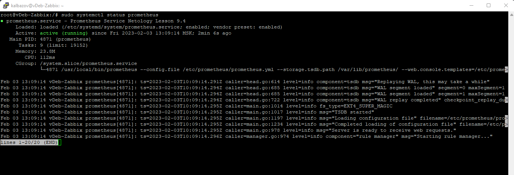
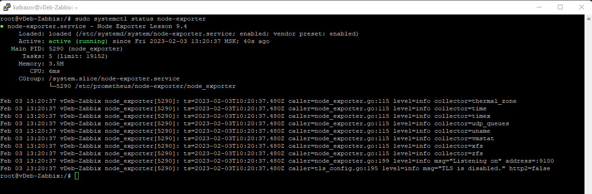
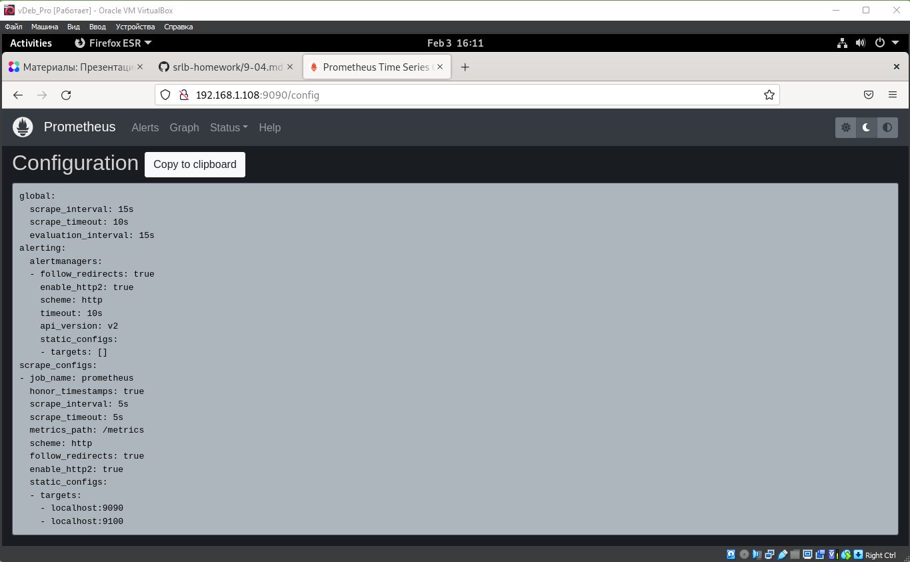

### Домашнее задание к занятию 9.4 «Prometheus»

## Задание 1

1. Установите Prometheus.
2. Приведите скриншот systemctl status prometheus, где будет написано: prometheus.service — Prometheus Service Netology Lesson 9.4 — [Ваши ФИО].

---

## Задание 2

1. Установите Node Exporter.
2. Приведите скриншот systemctl status node-exporter, где будет написано: node-exporter.service — Node Exporter Netology Lesson 9.4 — [Ваши ФИО].

---

## Задание 3

1. Подключите Node Exporter к серверу Prometheus.
2. Приложите скриншот конфига из интерфейса Prometheus вкладки Status > Configuration. Приложите скриншот из интерфейса Prometheus вкладки Status > Targets, чтобы было видно минимум два эндпоинта.

---
